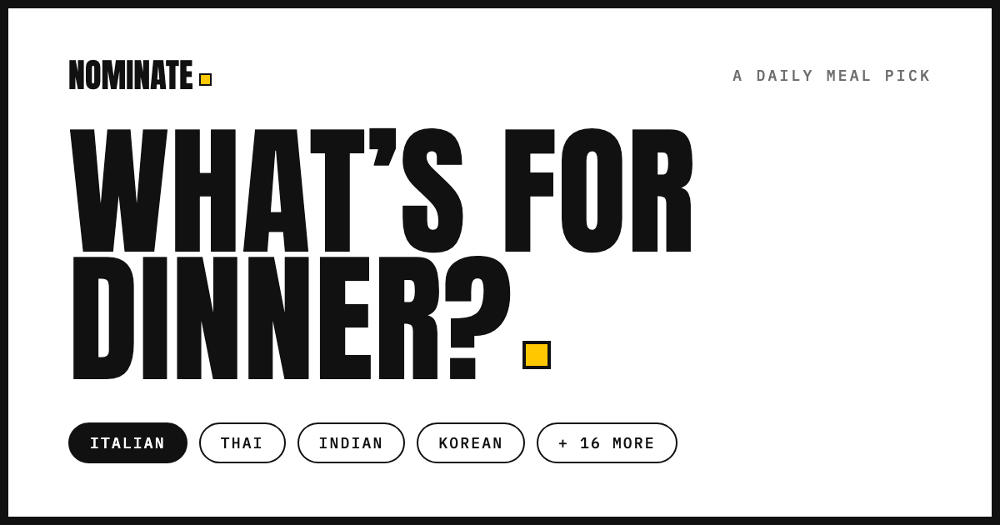

# NOMinate

[](https://github.com/ishitakapoor7/NOMinate-cheesehacks/actions/workflows/ci.yml)



**One dish a day, nominated for you.** NOMinate ends the nightly "what's for dinner?" spiral: it learns your taste, nominates a single dish each day, and then helps you follow through — pull up a real recipe to cook it, or find restaurants nearby that serve it. No endless scrolling, no decision fatigue. One good idea, then the resources to act on it.

### ▶︎ [Try it live → nominate-web.onrender.com](https://nominate-web.onrender.com)

*Sign up with an email or Google, set your taste profile, and get tonight's nomination. (Hosted on a free tier — the first request after it's been idle takes a few seconds to wake.)*

---

## How it works

1. **Tell it how you eat** — rank the cuisines you crave, set dietary needs and allergies, your kitchen skill, an eating goal, and what's already in your pantry.
2. **Get tonight's nomination** — a hybrid recommender scores the whole catalog against your taste, hard-filters anything unsafe or off-diet, and picks one dish — with enough variety that repeat visits stay fresh.
3. **Cook it or order it** — **Cook it tonight** shows a real recipe with steps and quantities, plus a checklist that highlights what you already have. **Order it out** surfaces nearby restaurants matched to the dish's cuisine, with ratings, price, hours, and directions.
4. **It learns you** — every signal (loved it → never again, and implicit ones like cooking or ordering a dish) sharpens the next nomination.

---

## Inside the recommender

The heart of NOMinate is a **hybrid recommendation model** trained in PyTorch: collaborative-filtering user/dish embeddings fused with content features (cuisine + an ingredient multi-hot). It's trained on **~42,000 real ratings across a 3,370-dish catalog** (20+ cuisines) drawn from the [Food.com](https://www.kaggle.com/datasets/shuyangli94/food-com-recipes-and-user-interactions) dataset — every dish is a real recipe with real steps and ingredients.

A few design decisions worth calling out:

- **Torch-free serving.** The model trains in PyTorch offline, but the trained weights are exported and inference runs in **pure NumPy** (verified to match PyTorch within ~1e-6). That keeps the production server small and cold-starts fast — no multi-hundred-MB torch dependency in the request path.
- **Safety is a hard filter, not a suggestion.** Allergens, dietary restrictions, skill level, and "is this actually a dinner main" are enforced as hard filters that remove a dish entirely — with **typo-tolerant allergen matching** (type "penut", it still blocks peanuts). Taste preferences (ranked cuisines, pantry overlap, calorie goal) are applied as scoring boosts on top.
- **It learns over time — two ways.** A live per-user affinity layer turns your in-app behavior (cooked / ordered / skipped) into cuisine and ingredient boosts on every request, so it adapts immediately. Separately, those accumulated ratings fold back into a full retrain, so returning users get a genuinely learned embedding instead of a cold-start average.
- **Honest heuristics for the rest.** Skill is derived from a recipe's step count, budget from restaurant price tiers, and eating goal from a dish's calorie tier — real signals from the data rather than features faked onto the user.

---

## Tech stack

| Layer | Stack |
|-------|-------|
| Frontend | React + Vite, Tailwind CSS, React Router |
| Backend | Flask (app factory + blueprints), SQLAlchemy, Alembic |
| Auth | JWT (access + refresh) with Google Sign-In |
| Database | PostgreSQL |
| ML | PyTorch (training), NumPy (serving), pandas, scikit-learn |
| External APIs | Google Places (restaurants), Google OAuth |

---

## Architecture

```
backend/
  app/
    auth/         signup / login / Google / JWT refresh
    api/          profile, recommend, cooking, takeout, feedback
    models/       SQLAlchemy models
    services/     recommender engine, personalization, retraining, recipes, places
  ml/             training pipeline, Food.com ingest, model, NumPy inference, checkpoints
  migrations/     Alembic migrations
  tests/          pytest suite
frontend/
  src/
    pages/        the seven screens (auth, profile, nomination, cooking, takeout, feedback)
    components/   nav, avatar, taste controls, route guards, Google button
    context/      AuthContext (session + tokens)
    lib/          axios client with automatic token refresh
```

The Flask API and the React app are deployed as separate services, backed by managed Postgres. Trained model checkpoints are committed, so the app serves recommendations out of the box.

---

## Quality

The backend suite (80+ tests) and a production frontend build run in **CI on every push and pull request** to `main` (badge above). Tests cover the full flow — auth, profile, recommendation filtering and boosts, the allergen/diet safety nets, the learning layer, and the recipe/restaurant integrations (external APIs mocked).

---

## API overview

| Method | Endpoint | Purpose |
|--------|----------|---------|
| `POST` | `/auth/signup`, `/auth/login`, `/auth/google` | Authentication |
| `POST` / `GET` | `/auth/refresh`, `/auth/me` | Session |
| `GET` / `PUT` | `/api/profile` | Taste profile |
| `GET` | `/api/recommend`, `/api/recommend/latest` | Daily nomination |
| `POST` | `/api/cooking` | Recipe + ingredient checklist |
| `POST` / `GET` | `/api/takeout`, `/api/takeout/photo` | Nearby restaurants |
| `POST` | `/api/feedback` | Rate the nomination |

---

<sub>Started at CheeseHacks, since rebuilt into a full-stack product with persistent accounts, a recommender trained on real data, and live restaurant search.</sub>
